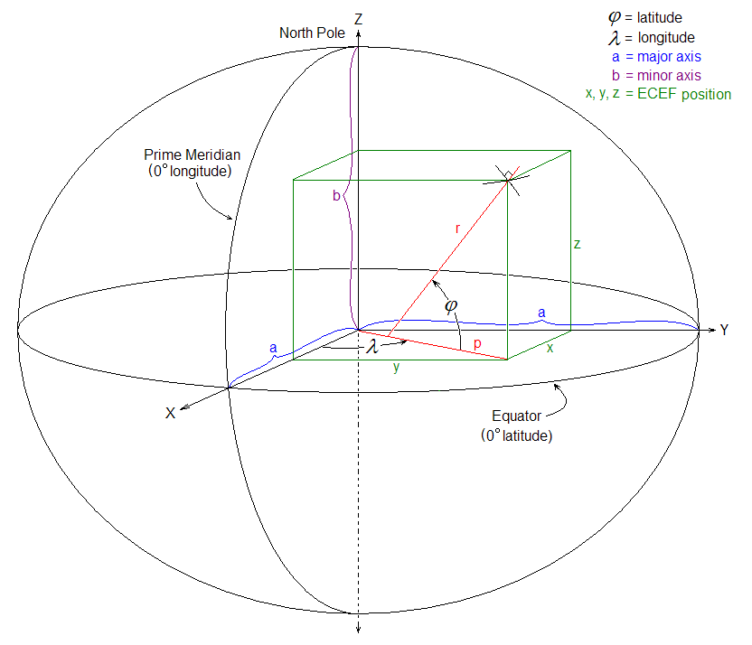
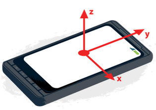
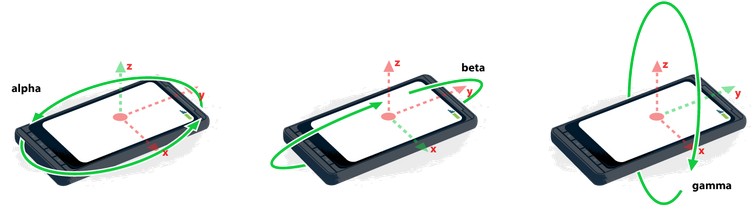
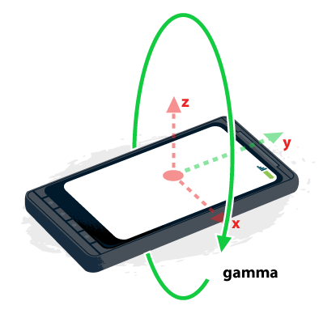

# 陀螺仪的基础知识

## HTML5 Orientation
`HTML5 Orientation` 是HTML5中一个非常酷的特性，它主要用来检测智能设备（手机、平板等）的运动方向。在现在的移动端开发中已给用户带来更良好的体验，也在很多项目中发挥了重要的重用。

目前在下面的场景中常常能看到其相关的身影：

* 控制游戏 - Web游戏应用监控设备方向，并将其解释为控制屏幕上的精灵在某方向上的倾斜。
* 手势识别 - Web应用监控设备的加速，并将其应用于信号处理，以便识别特定首饰。距离说明，使用摇晃手势清除web表单。
* 地图 - Web地图应用使用设备方向，将地图与实际情况对齐。

在使用设备运动方向(Device Orientation)API之前，先得确保浏览器支持这些API。支持性判断：
```
if (window.DeviceOrientationEvent) {
    //  支持DeviceOrientation API写在这里
} else {
    console.log("对不起，您的浏览器还不支持Device Orientation!!!");
}
```


## 地球坐标系统
先来看一张地球坐标系统的图：



地心地固坐标系（Earth-Centered, Earth-Fixed，简称ECEF）简称地心坐标系，是一种以地心为原点的地固坐标系（也称地球坐标系），是一种笛卡儿坐标系。原点 `O` `(0,0,0)` 为地球质心，`z` 轴与地轴平行指向北极点，`x` 轴指向本初子午线与赤道的交点，`y` 轴垂直于 `xOz` 平面(即东经90度与赤道的交点)构成右手坐标系。

地球坐标系统是由 `x`、`y`、`z` 三个轴组成，基于重力和标准磁场方向。简单点讲，地球坐标系统是一个位于用户位置的东、北、上系，其拥有 `3` 个轴，地面相切与1984世界测地系统的Spheriod的用户所在位置。

* 东(`x`)在地面上，垂直于北轴，向东为正 (东西方向)
* 北(`y`)在地面上，向正北为正（指向北极）（南北方向）
* 上(`z`)垂直于地面，向上为正（上下方向）

对于一个移动设备，例如电话或平板，设备坐标系的定义于屏幕的标准方向相关。这意味着类似于键盘的滑动元素没有展开、类似于显示器的选择元素折叠至其默认位置。如果在设备旋转或展开滑动键盘时屏幕方向发生变化，这不会影响关于设备的坐标系的方向。

用户希望获得这些屏幕方向的变化可以使用现有的 `orientationchange` 事件。

* `x` 在屏幕或键盘平面上，屏幕或键盘的右侧为正。
* `y` 在屏幕或键盘屏幕上，屏幕或键盘的上方为正。
* `z` 垂直于屏幕或键盘屏幕，离开屏幕或键盘为正。

如下图所示：



从地球坐标系到设备坐标系的转变必须按照下列系统转换。旋转必须使用右手规则，即正向沿一个轴旋转为从该轴的方向看顺时针旋转。从两个系重合开始，旋转应用下列规则：

* 以设备坐标系 `z` 轴为轴，旋转 `alpha` 度。`alpha` 的作用域为 `(0, 360)`。
* 以设备坐标系 `x` 轴为轴，旋转 `beta` 度。`beta` 的作用域为 `(-180, 180)`。
* 已设备坐标系 `y` 轴为轴，旋转 `gamma` 度。`gamma` 的作用域为 `(-90, 90)`。

如下图所示：




## Alpha, Beta 和 Gamma 角
Alpha(`α`), Beta（`β`） 和 Gamma（`γ`）角也称之为旋转数据。旋转数据作为欧拉角(Euler Angle)返回，是设备坐标系和地球坐标系之间的差异值。

在解释Alpha、Beta和Gamma这三个角之前，我们需要定义存在的空间。如下图所示，展示了移动设备上使用的三维坐标系统:


在手机或者平板上，设备定位方向是基于屏幕方向的。对于手机和平板来说，他们都是基于纵向模式的设备，对于台式机或笔记本电脑来说，他们的定位方向和键盘有关。


### Alpha（α）角
Alpha（α）角代表的是z轴。因此，任何沿着z轴旋转都会使用Alpha(α)角变化。Alpha(α)的变化范围是(0~360)度之间。当α = 0时，设备是直接每日向地球的北极。下图显示了α旋转。


设备逆时针旋转，Alpha(α)值增加。


### Beta（β）角
Beta（β）角代表的是x轴。设备绕着x轴旋转将导致Beta（β）角变化。Beta（β）的变化范围是(-180 ~ 180)度之间。当设备平行于地球表面时β = 0，比如说，你把手机平放在桌面上。下图显示了β旋转:


### Gamma(γ)角
Gamma(γ)角代表的是y轴。设备绕着y轴旋转将导致Gamma(γ)角变化。Gamma(γ)角的变化范围是(-90 ~ 90)度。当设备平行于地球表面时γ = 0。下图显示了γ旋转:




## 重力感应
说到重力感应有一个东西不得不提，那就是就是陀螺仪，陀螺仪就是内部有一个陀螺，陀螺仪一旦开始旋转，由于轮子的角动量，陀螺仪有抗拒方向改变的特性，它的轴由于陀螺效应始终与初始方向平行，这样就可以通过与初始方向的偏差计算出实际方向。


## deviceorientation事件
设备方向事件会返回设备旋转角度数据，如果手机或者笔记本电脑有指南针的话，返回数据中还会包括设备当前的朝向。在 HTML5 OrientationAPI 提供了三个相应的DOM事件:

* `deviceorientation` - 其提供设备的物理方向信息，表示为一系列本地坐标系的旋角

* `devicemotion` - 其提供设备的加速信息，表示为定义在设备上的坐标系中的卡尔迪坐标。其还提供了设备在坐标系中的自转速率。若可行的话，事件应该提供设备重心处的加速信息。

* `compassneedscalibration` - 其用于通知Web站点使用罗盘信息校准上述事件。


### 检测和监听方向事件
设备方向事件有几种使用场景，例如：

* 更新移动的用户的地图
* UI调整，像是增加Paralax（视差滚动：指让多层背景以不同的速度移动，形成立体的运动效果，带来非常出色的视觉体验）效果
结合地理定位，用于导航
* 检测和监听方向事件

在监听 `DeviceOrientationEvent` 事件前，我们首先要检查浏览器是否支持。然后再在 window 中增加 `deviceorientation` 事件监听。
```
if (window.DeviceOrientationEvent) {
    window.addEventListener('deviceorientation', deviceOrientationHandler, false);
    document.getElementById("doeSupported").innerText = "";
}
```

当设备移动或者方向改变时，设备方向事件就会被触发。它会返回当前位置相对于地球坐标的差值。

事件通常会返回 `Alipha`、`Beta` 和 `Gamma` 三个值。在移动端Safari浏览器中，还会返回 `webkitCompassHeading` 属性值，这个属性值与指南针（compass）的导向有关。


### 检测和监听移动事件
监听 `DeviceMotionEvents` 事件前，首先要检查浏览器是否支持，然后再在 window 上监听 `devicemotion` 事件。
```
if (window.DeviceMotionEvent) {
    window.addEventListener("devicemotion", deviceMotionHandler);
    setTimeout(stopJump, 3*1000);
}
```


### 只用自定义界面通知用户校准罗盘
```
window.addEventListener("compassneedscalibration", function(event) {
    alert('您的罗盘需要校准，请将设备沿数字8方向移动。');
    event.preventDefault();
}, true);
```