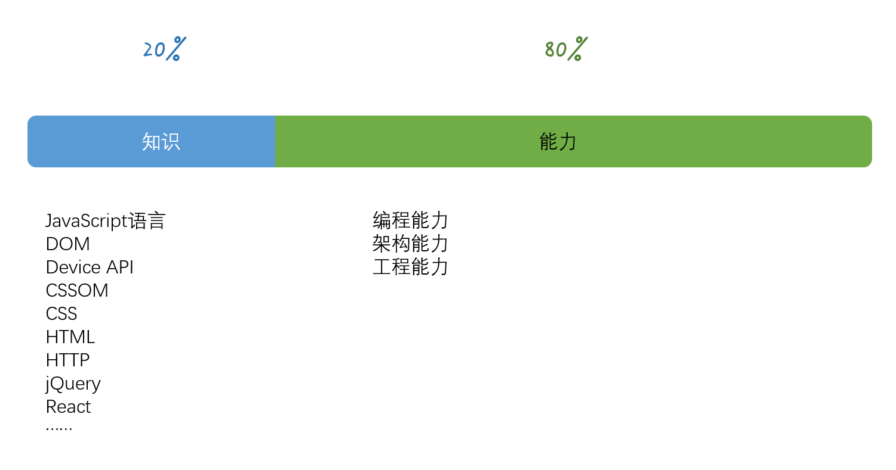
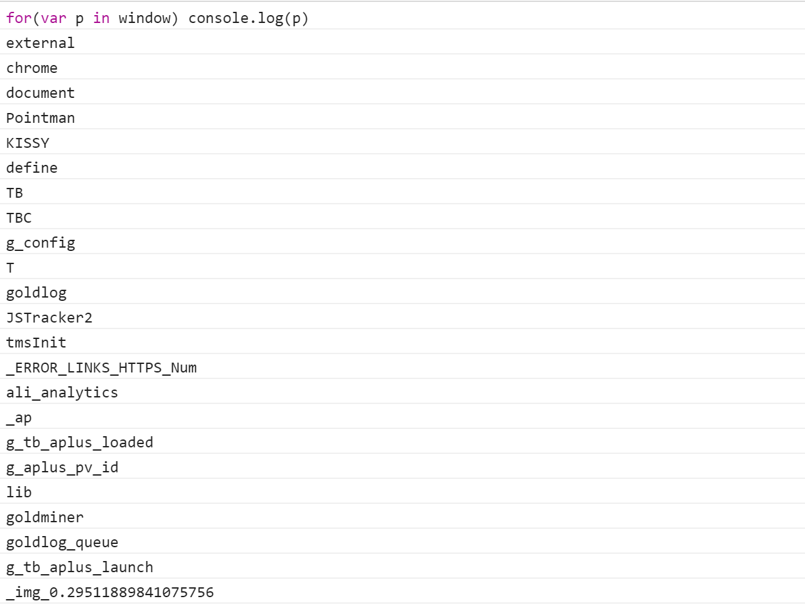
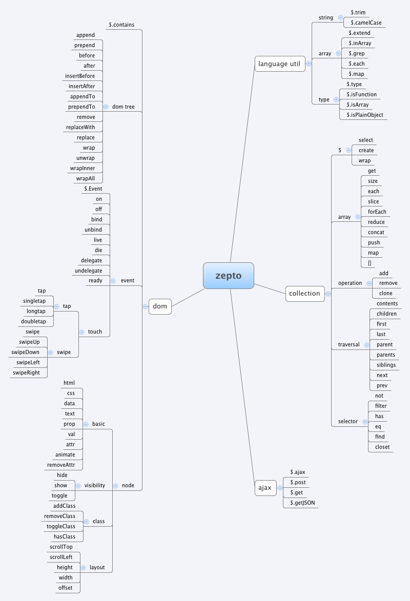
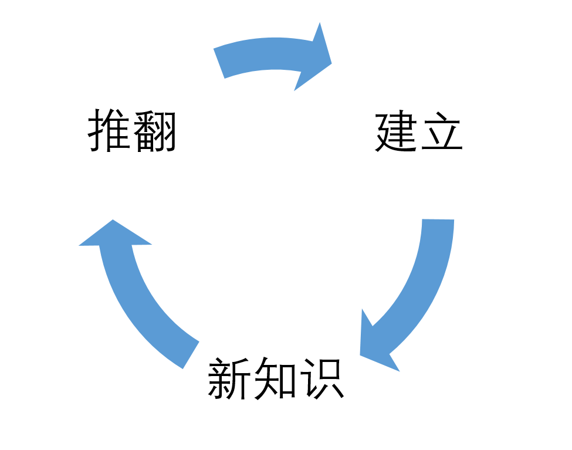

# 一个前端的自我修养

> 原文出处：[winter](http://taobaofed.org/blog/2016/03/23/the-growth-of-front-end/)。


前端的自我成长，这是一个关于成长的话题。成长，是自己的事情。

You are the owner of your career.

你是你职业发展的责任人。这句话潜台词是，你（不是你老板，也不是你爸妈，也不是你女朋友）是你职业发展的责任人。



前端成长，包含‘知识’和‘能力’两个方面，知识占 20%，而能力占 80%。

知识分为两部分：

- 标准：它是相对而言比较稳定的，很少会出现一个标准被推翻的事情；
- 技术：像是 jQ、React 这些框架啦，像是 MVC、FLUX 这些架构的东西，这些东西是由各个公司主导的，变化就非常快，你看 Grunt 发展了没多久，Gulp 就来挑战他了，然后又有 browserify、webpack 这些东西，他们的更新迭代非常快。

关于能力：

**编程能力**，就是用代码解决问题的能力，你编程能力越强，就能解决越复杂的问题，细分又有调试、算法、数据结构、OS 原理等这些的支撑，你才能解决各种麻烦的问题。

**架构能力**，则是解决代码规模的问题，当一个系统足够复杂，你会写每一块，能解决每一个问题，不等于你能搞定整个系统，这就需要架构能力，架构能力包含了一些意识，比如解耦、接口隔离，也包含认识业务建立抽象模型，也有一些常见的模式，比如经典的 MVC，还有设计层面，面向对象、设计模式等等。

最后**工程能力**，则是解决协作的问题，当系统规模更大，光靠一个人，是没办法完成的，如何保证几个高手互相能够配合好？如何保证项目里面水平最差的人不拖后腿？这个工程化建设，往往会跨越多个业务，以汇报关系上的团队为单位来做。包括前后端解耦，模块化，质量保证，代码风格，等等。

其实不难看出来，这三项，其实是有顺序的，低等级、小团队，编程能力一项就能应付，越资深的前端，越大的公司和团队，越是需要后面的技能。


对知识学习，要保持宁缺毋滥的态度。知识学习的目标，理解为两点，一曰准确，二曰全面。

如何建立自己的知识体系呢？

**第一步，寻找线索。**

在这个知识爆炸的年代，学习知识有各种各样的途径，但是面对天花乱坠的知识海洋，怎样做才能更快更好的学习呢？

推荐找一些足够全面的资料当作线索：

1. 标准文档，及其附录；
2. 源码结果定义；
3. 官方文档；

对 Web 平台的 API，使用反射：

```js
for (var p in window) {
  console.log(p);
}
```



**第二步，是建立联系。**

比如说，看下面几个 DOM 属性：


这里，左边一列是操作 Node 的，右边一列是操作 Element 的，它就存在一定的对应关系。

一般来说，我们找对应关系的方式有以下几个依据：

- 美感
- 完备性
- 操作同一组数据

特别提一下，操作同一组数据，正是面向对象的核心概念，对前端而言，有点不一样的是，所有的 API，根都是 window，所以，其实大部分的 API，可以依据面向对象的数据和操作的观点进行划分。

**第三步，是分类。**

这里我给出一个实际一些的例子，下图是我对 zepto(移动简化版 jQuery)的 API 分类。



建立联系以后，我们依据知识之间的联系，进行分类，就可以得到一张图谱，在这个图里面，你就可以非常清楚地知道，哪些知识，是非常重要的，哪些，其实是可以互相替代的。

而一旦有你之前没见过的东西，你又能通过把它放到图谱里，来快速理解它，或者找出一些很好的替代方案。

**第四步，是追本溯源。**

当对一个知识体系的全貌有了概念以后，占了全面两个字，接下来需要确认它的准确性。很多知识，在社区，会有很多的争议，该相信谁呢，这是个问题。而答案，就是追本溯源，去找它最初的讨论和定义。

建立知识体系的过程，是不断接受新知识，挑战、质疑原有的体系，推翻再重建，每一次循环，你的知识体系都变得更加坚固，更加强大。


